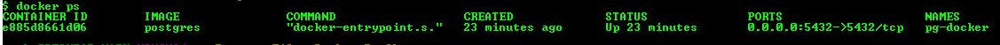
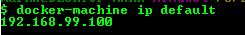
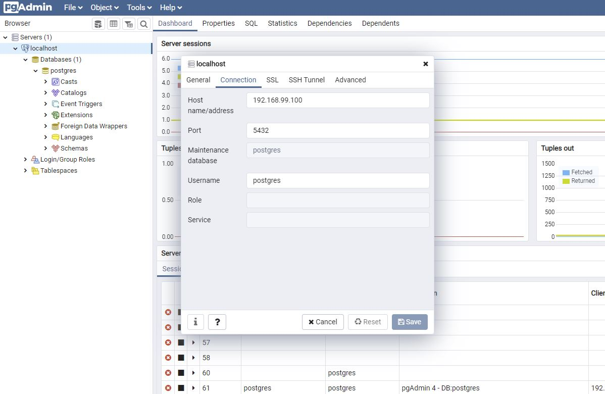

# Awesome-CMDB-Collector
Tool for storing the cloud inventory in to a Database


# Create a Postgresql database for the server data to be stored in
```
docker run --rm   --name pg-docker -e POSTGRES_PASSWORD=docker -d -p 5432:5432 postgres
```

You should see the following output.



Check you can connect to the database using your prefered client, for example [pgAdmin](https://www.pgadmin.org/)

If using Docker Toolbox on windows use the following command to get the ip of the docker host

```
docker-machine ip default
```



Use this infomation in pgAdmin to check your Postgresql instance is running, filling in the IP address of your docker host and password used in the docker run command above.

